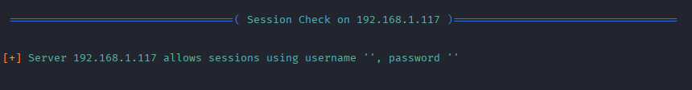
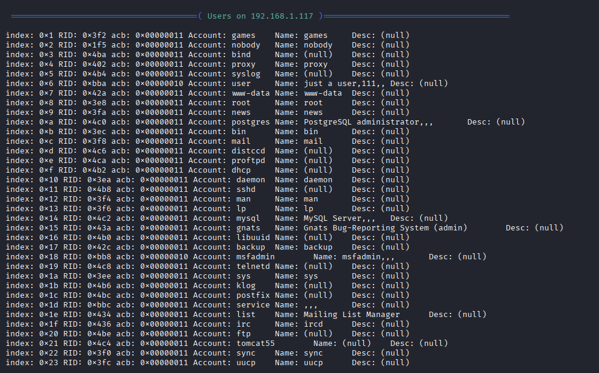
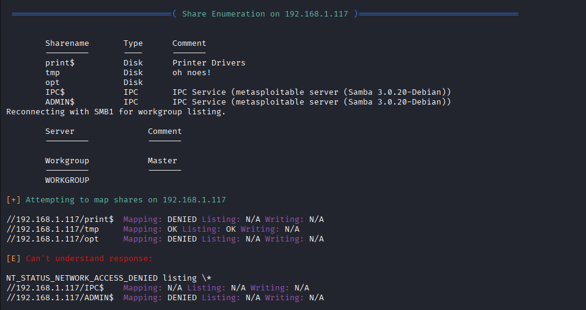
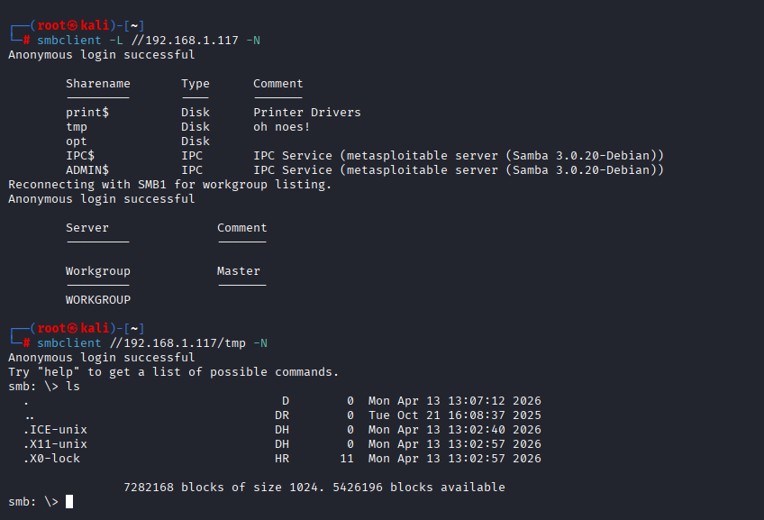

# Lab 03 - SMB Enumeration and Anonymous Access

---

## Scope

Target: Metasploitable 2  
Target IP: 192.168.1.117  
Environment: Isolated Lab Network  

---

## Objective

The objective of this lab is to enumerate SMB services and identify misconfigurations that allow unauthorized access, including anonymous authentication and exposed network shares.

---

## Step 1 - SMB Enumeration with enum4linux

```bash
enum4linux 192.168.1.117
```

### Explanation

The `enum4linux` tool is used to extract information from SMB services, including users, shares, domain details, and security configurations.

### Findings

The enumeration revealed critical information:

- The server allows anonymous (null session) access
- Multiple system users were identified, including:
  - root
  - msfadmin
  - www-data
- The system is part of a workgroup: WORKGROUP
- Samba version identified: Samba 3.0.20 (outdated and vulnerable)

### Real-World Relevance

Anonymous access to SMB services is a serious misconfiguration. It allows attackers to gather sensitive information without authentication, which can be used for:

- User enumeration
- Password attacks
- Privilege escalation
- Lateral movement inside networks

### Evidence





---

## Step 2 - Share Enumeration

```bash
smbclient -L //192.168.1.117 -N
```

### Explanation

The `-L` flag lists available SMB shares, and `-N` allows connection without a password (anonymous login).

### Findings

- Anonymous login was successful
- Anonymous access was permitted via SMB (null session)
- The following shares were identified:
  - tmp
  - opt
  - print$
  - IPC$

### Real-World Relevance

Listing shares without authentication indicates poor access control and increases the attack surface.

### Evidence

 

---

## Step 3 - Accessing SMB Share

```bash
smbclient //192.168.1.117/tmp -N
ls
```

### Explanation

This command connects to the `tmp` share without authentication and lists its contents.

### Findings

- Anonymous access to the `tmp` share was successful
- Directory contents were exposed without authentication

### Real-World Relevance

Unauthorized access to shared directories may lead to:

- Sensitive data exposure
- File upload opportunities (malware/backdoors)
- Privilege escalation vectors

### Evidence



---

## Impact

- Unauthorized access to SMB shares
- Information disclosure (user accounts, system configuration, and network details)
- Increased attack surface for further exploitation
- Potential for lateral movement in real environments

---

## Recommended Mitigation

- Disable anonymous SMB access
- Enforce authentication for all shares
- Restrict access using proper permissions
- Update Samba to a secure version
- Monitor SMB access logs for suspicious activity

---

## Disclaimer

This lab was conducted in a controlled environment for educational and ethical testing purposes only.
